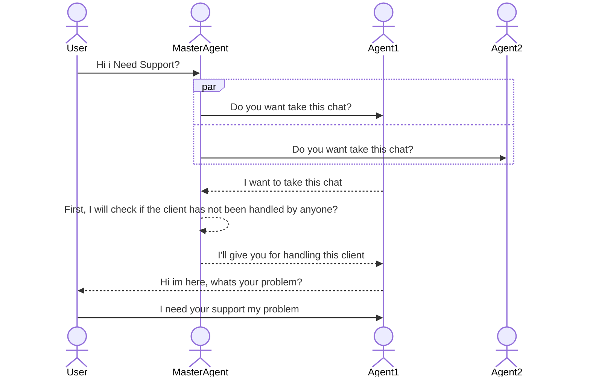

```mermaid
   sequenceDiagram
        actor User
        actor MasterAgent
        actor Agent1
        actor Agent2
        User ->> MasterAgent: Hi i Need Support?
        par 
            MasterAgent->>Agent1: Do you want take this chat?
        and 
            MasterAgent->>Agent2: Do you want take this chat?
        end
        Agent1 -->> MasterAgent: I want to take this chat
        MasterAgent -->> MasterAgent: First, I will check if the client has not been handled by anyone?
        MasterAgent -->> Agent1: I'll give you for handling this client
        Agent1 -->> User: Hi im here, whats your problem?
        User ->> Agent1: I need your support my problem

```